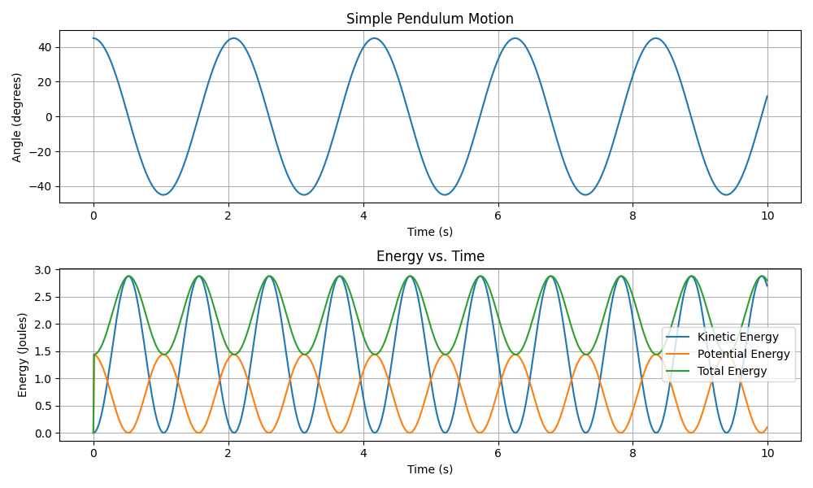

# classical-mechanics
 
This repository contains all the codes for basic classical mechanics problems

## Simple Pendulum
A simple pendulum is a classic example of a mechanical system that exhibits harmonic motion. It consists of a mass called the pendulum bob attached to a string or rod fixed length. When the pendulum is displaced from its equilibrium position and released, it oscillates back and forth.

- Equation of motion:

**i)** Angular Displacement equation:
The angular displacement $\theta$ of the pendulum from its vertical position at any time t can be expressed as:

$$
\theta(t) = \theta0 * \cos(&radic;(\frac{g}{L})) * t
$$

**ii)** Angular velocity equation:
The angular velocity $\omega$ of the pendulum at any time t is given by:

$$
\omega(t) = &radic;(\frac{g}{L}) * \theta0 \sin(&radic;(\frac{g}{L}))*t
$$

Following is the resulting graph of energy curves (between KE, PE, TE) and Angle v/s Time

