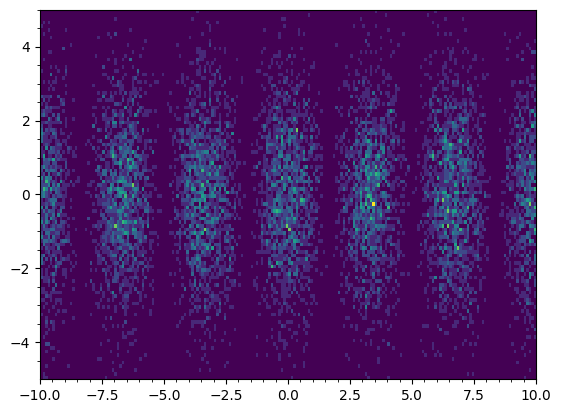

# double-slit-simulator
 To simulate the double slit experiment

## Young's Double Slit Experiment theory

Young's Double Slit experiment is a classic experiment in physics that demonstrates the wave-particle duality of particles, such as electrons or photons. It was first performed by Thomas Young in the early 19th century. The experiment illustrates the interference patterns that occur when waves, or particles exhibiting wave-like behavior, pass through two closely spaced slits and then interact with a screen. The key observations and concepts of the experiment include:

- **Wave- Particle Duality:** In quantum physics, particles like electrons and photons can exhibit both particle-like and wave-like behavior. The experiment demonstrates the wave-like nature of particles.

- **Interference Pattern:** When a coherent source of light or particles is passed through two slits and strikes a screen, an interference pattern of alternating light and dark bands is observed on the screen. This pattern results from the superposition of waves from the two slits.

- **Single Slit Diffraction:** When a single slit is used instead of two slits, it produces a diffraction pattern characterized by a central maximum and smaller side maxima and minima. This is due to the wave nature of the particles.

- **Probability Distribution:** The intensity of light or the probability distribution of particle impacts on the screen varies depending on the angle of impact.

- **Distance to the Screen:** The spacing between the slits, the distance to the screen, and the wavelength of the particles play a crucial role in determining the interference pattern's characteristics.

- **Measurement effects:** The act of measuring or detecting which slit a particle passes through can collapse the interference pattern into a pattern more characteristic of particles.

## Results

The code thus allows to experiment with different parameters, such as slit width, distance to the screen, and the number of electrons fired, to observe and analyze the interference patterns and their behavior under various conditions.

