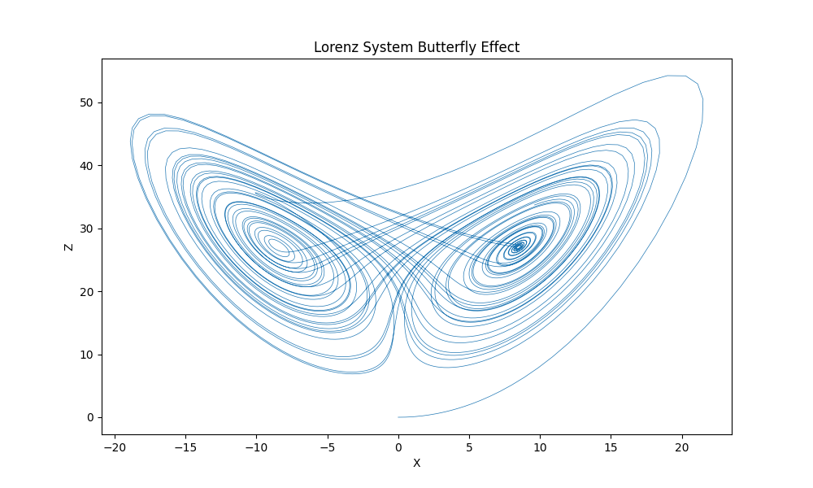

# lorenz-system
This following repository is to study the Lorenz system of the Chaos Theory

## Introduction
* It is a set of three ordinary differential equations that describe a chaotic, determinstic and non-linear dynamic system.
* It was developed by meterologist Edward Lorenz in the early 1960 to model atmospheric convection, but it has since become a fundamental example of chaos theory
* It is represented by there coupled differential equation: 

$$
\frac{dx}{dt} = \sigma \cdot (y - x)
$$

$$
\frac{dy}{dt} = x \cdot (\rho - z) - y
$$

$$
\frac{dz}{dt} = xy - \beta \cdot z
$$

## Lorenz System Behavior 

* Sensitivity to Intial Conditions

= The Lorenz System is highly sensitive to its initial condition, small differences in the inital values of x, y and z can lead to dramatically different trajectories over time.

* Strange Attractor

= The Lorenz System does not settle into a stable equilibrium on periodic orbit. Instead its trajectories form a complex non-repeating pattern as "Strange attractor". 

* Bigurcations

= By varying the parameters $\sigma, \rho, \beta$ one can observe bifurcation digrams that shows how the system's behavior chages as these parameters are adjusted. Bifurcations are points at which the system transitions from one type of behavior to another, such as from periodic to chaotic motion.

