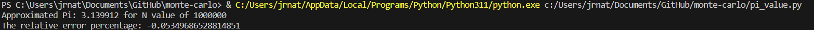
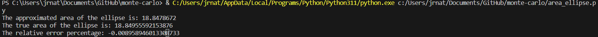
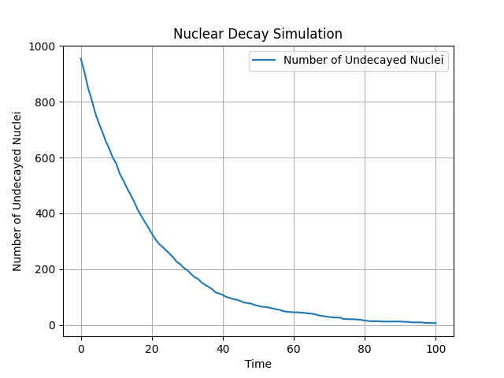

# Monte-Carlo Simulations
This following repository is to study the relevant systems using Monte-Carlo method and simulation.

### About Monte-Carlo method
The Monte-Carlo method is a computational technique used to solving complex problems through random sampling. It is named after the Monte Carlo Casino in Monaco, known for its game of chance, as randomness is a fundamental element of this method. Monte-Carlo methods are widely used in various fields, including Physics, Engineering, Finance and statistics.

This is the following method by which the Monte-Carlo method works:

- Problem Representation: First, the problem is formulated in a way that involves uncertainty or randomness. This could include probabilistic events, multiple variables, or systems with many possible states.

- Random Sampling: Random samples or simulations are generated to estimate the solution. These samples are typically drawn from probability distributions that represent the uncertain or random aspects of the problem.

- Calculation: For each sample, the problem's model or equations are applied, and the result is recorded. This step may involve mathematical calculations, simulations, or other computations.

- Aggregation: The results from all the samples are aggregated or averaged to produce an approximate solution or an estimation of the desired outcome. The law of large numbers ensures that as the number of samples increases, the estimate becomes more accurate.

## Approximating the value of Pi:

The methodology: 

- The program begins by defining a function called estimate_pi(N), where N represents the number of random points or "shots" to be generated.

- Inside the estimate_pi function:

  - A counter, 'm', is initialized to keep track of the number of points falling inside the unit quarter circle.
  - A loop runs N times, generating pairs of random numbers, 'x' and 'y,' both ranging from 0 to 1.

  - The program checks if each point (x, y) falls within the unit quarter circle using the equation x^2 + y^2 <= 1. If it does, 'm' is incremented.

- The estimated value of π is then calculated using the formula: π ≈ 4 * (m / N).

## Calculating the area of the ellipse: 

The methodology: 

- Importing Dependencies:

  - The code begins by importing the necessary Python libraries, namely NumPy for mathematical operations and random for random number generation.

- Estimating the Ellipse Area:

  - The estimate_ellipse_area function is defined to perform the area estimation. It takes four input parameters: num_measurements, num_trials, semi_major_axis, and semi_minor_axis.

  - A counter points_inside_ellipse is initialized to keep track of the number of random points that fall inside the ellipse.

  - The code uses nested loops to generate random (x, y) points within the bounding box of the ellipse, which is defined by the semi-major and semi-minor axes.

  - The points are checked against the equation of the ellipse to determine if they fall inside it.
 
  - The estimated area of the ellipse is calculated based on the ratio of points inside the ellipse to the total number of points generated.

- Input Parameters and Execution:

  - The code specifies input parameters such as the number of measurements per trial (num_measurements), the number of trials (num_trials), the semi-major axis (semi_major_axis), and the semi-minor axis (semi_minor_axis) of the ellipse.

- True Area and Error Calculation:

  - The code calculates the true area of the ellipse using the formula for the area of an ellipse.

  - It then computes the relative error percentage by comparing the estimated area to the true area.

- Output:

Finally, the code prints the estimated area of the ellipse, the true area, and the relative error percentage to assess the accuracy of the Monte Carlo estimation.

## Nuclear Decay simulation using Monte Carlo method

Nuclear decay is a fundamental process in nuclear physics and chemistry, where unstable atomic nuclei transform into more stable configurations by emitting radiation. This decay process is governed by a probability of decay for each individual nucleus and is a random event. The Monte Carlo method is a powerful numerical technique that uses random sampling to simulate complex systems or processes, making it well-suited for modeling nuclear decay

Methodology:

- Constants: 
  -  We define several constants, including the initial number of parent nuclei (N0), the initial number of daughter nuclei (D0), the probability of decay (p), and the total simulation time (total_time).

- Data Storage:
  -  We initialize lists, time_points and n_values, to store the simulation data. time_points will track time, and n_values will record the number of undecayed nuclei at each time step.

- Initialization:
  -  We initialize the simulation time t to 0.

- Main Simulation Loop:
  -  We enter a loop that continues until either all parent nuclei have decayed (N=0) or the total simulation time has been reached. Inside this loop, we perform the following steps:

    -    a. We store the current number of undecayed nuclei in NU.

    -    b. We loop NU times to check each of the remaining nuclei. For each nucleus, we generate a random number x between 0 and 1 using the random.random() function.

    -    c. If the generated random number x is greater than 0 and less than or equal to the probability of decay p, we decrease the number of parent nuclei N by one and increase the number of daughter nuclei D by one, simulating a decay event.

    -    d. We record the current time t, the updated number of undecayed nuclei N, and repeat the process for the next time step.

- Data Visualization:
  -  After the simulation is complete, we use the matplotlib library to create a graph showing the number of undecayed nuclei (n_values) as a function of time (time_points). This visualization provides a clear representation of the nuclear decay process over time.

 Results:
 The resulting graph illustrates the decay of parent nuclei over time, showing a gradual decrease in the number of undecayed nuclei
 